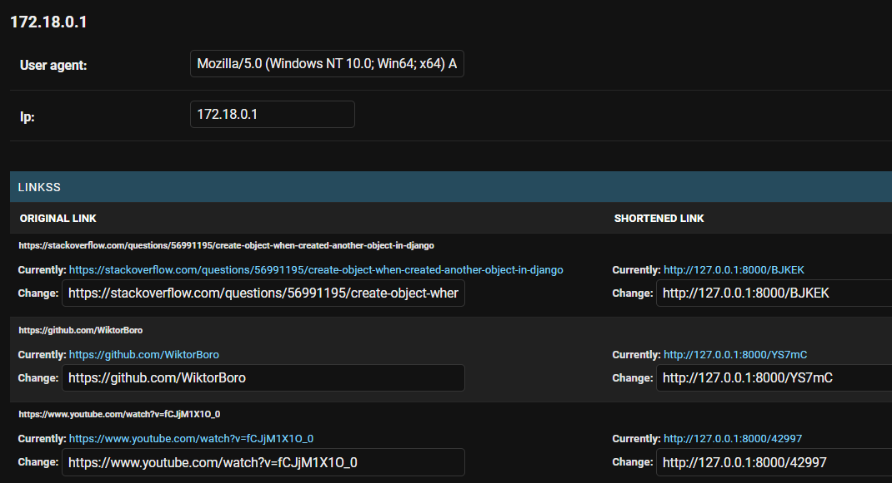

# Heroku deploy

`https://shorten-the-link1.herokuapp.com`

## Functions

1. Link shortening
2. Possibility to choose what the link will consist of (digits, uppercase, lowercase) and how long it will be
3. Collecting the IP and user agents of users who shorten the link
4. Number of entries on shortened links

## Endpoints 
```
    "Endpoint": "api/shortener-link"
    "ReturnedForm": {"original_link": str,"shortened_link": str}

    POST: Return JSON with 'original link' and created 'shortened link' if 'original link' was shortened before, return
    already existing shortened link

    :return 200: return already existed shortened url
    :return 201: create new shortened url
    :return 400: serializer error
```


# Quickstart

### Clone git repo

In project folder run

`git clone https://github.com/WiktorBoro/drf_link_shortener.git`

### Run docker-compose
Make sure you have run your docker app!

In project folder run

`docker-compose up`

### Connect with docker container

`docker-compose exec backend sh`

### Migrate database
In docker container run

`python manage.py makemigrations`
`python manage.py migrate`

### Create superuser
In docker container run

`python manage.py createsuperuser`

Fill in the fields

### Done!

Now on 
http://localhost:8000
you have a working API

On 
http://localhost:8000/admin/panel
you have admin panel with all data

### Run the test
In docker container run

`python manage.py test --verbosity 2`

## Example of use

Go to the endpoint visualization
http://localhost:8000/api/shortener-link

Enter a sample link and click on a post


Response with status 201


If the same link is shortened again, return the same link with status 200


## Admin page details

### Config 

You can choose how long the link will be and what it will consist of

!IMPORTANT!

#### The application is not secured at this point, setting the link length value to 0 or deselecting all creation parameters to false will result in an error


### Statistics 
Shortened link and the number of times enters


### Links 
List of all original and shortened links, 

After click, you can see the IP of the user who shortened the link


### Users info
You can see all users who shortened the link


After entering the user, you can see his user agent and all the links he added
